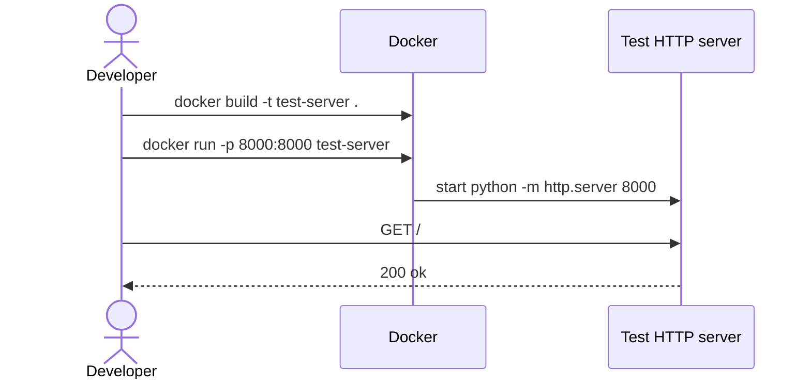

# Basic Dockerfile: sequence

```mermaid
sequenceDiagram
    actor Dev as Developer
    participant D as Docker
    participant S as Test HTTP server
    Dev->>D: docker build -t test-server .
    Dev->>D: docker run -p 8000:8000 test-server
    D->>S: start python -m http.server 8000
    Dev->>S: GET /
    S-->>Dev: 200 ok
```
