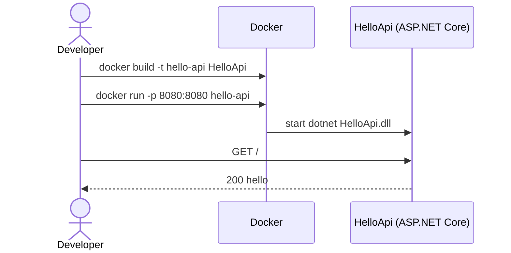

# Basic .NET API in Docker: sequence

```mermaid
sequenceDiagram
    actor Dev as Developer
    participant D as Docker
    participant A as HelloApi (ASP.NET Core)
    Dev->>D: docker build -t hello-api HelloApi
    Dev->>D: docker run -p 8080:8080 hello-api
    D->>A: start dotnet HelloApi.dll
    Dev->>A: GET /
    A-->>Dev: 200 hello
```
