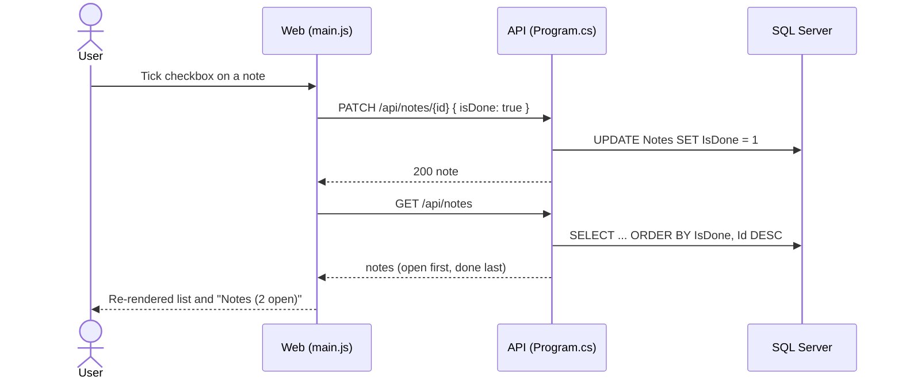

# Sequence: Mark notes as done

```mermaid
sequenceDiagram
    actor User
    participant Web as Web (main.js)
    participant API as API (Program.cs)
    participant DB as SQL Server

    User->>Web: Tick checkbox on a note
    Web->>API: PATCH /api/notes/{id} { isDone: true }
    API->>DB: UPDATE Notes SET IsDone = 1
    API-->>Web: 200 note
    Web->>API: GET /api/notes
    API->>DB: SELECT ... ORDER BY IsDone, Id DESC
    API-->>Web: notes (open first, done last)
    Web-->>User: Re-rendered list and "Notes (2 open)"
```
